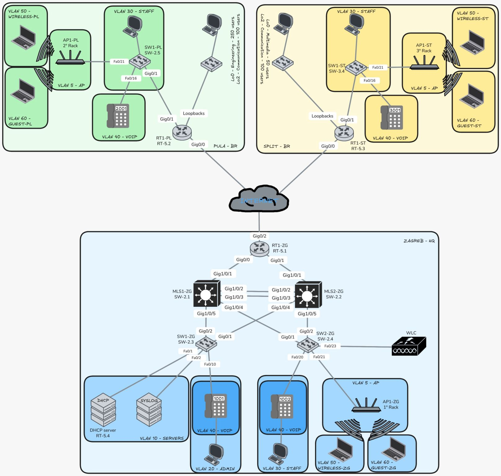
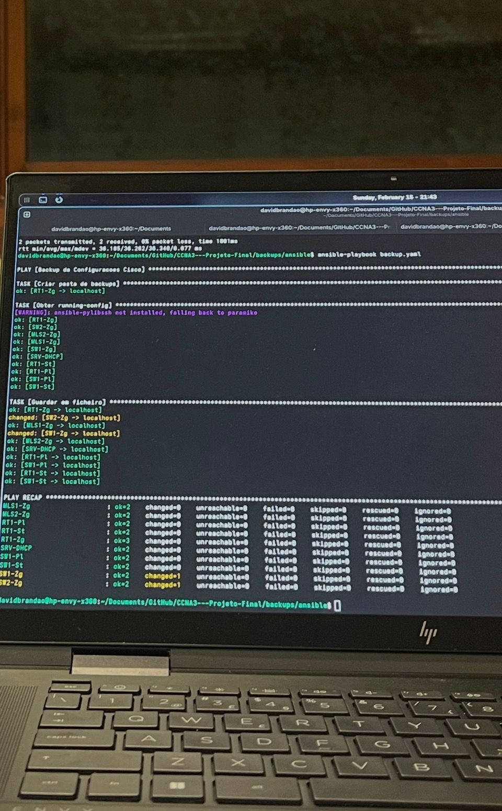
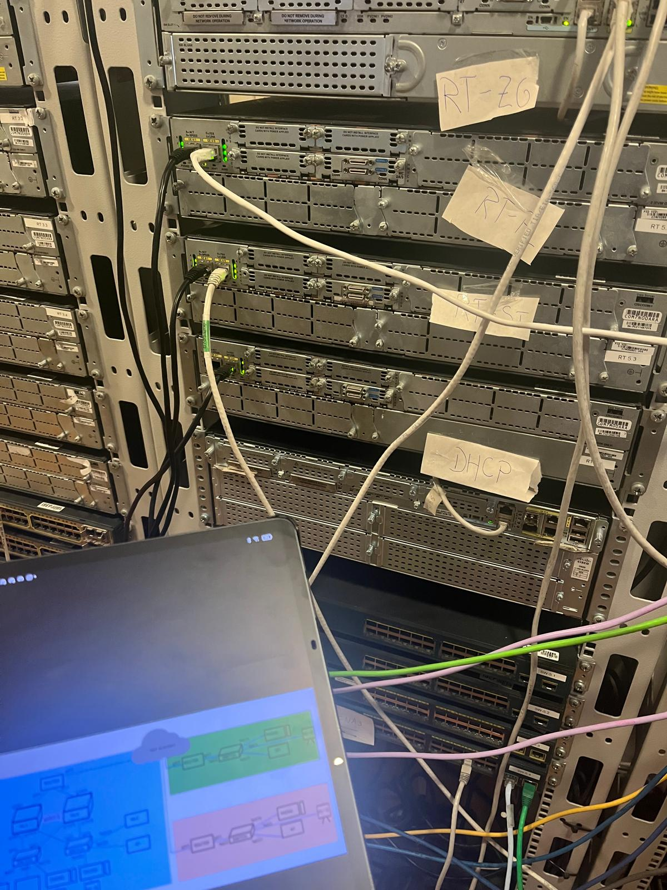

# Automated Enterprise Network Infrastructure (Cisco + Ansible)

> **Architectural Proof of Concept:** End-to-end deployment of a highly available, secure, and automated multi-site corporate network, integrating bare-metal Cisco routing with Infrastructure as Code (IaC) principles.


*Figure 1: High-level logical topology encompassing the Zagreb HQ and branch offices (Pula & Split).*

---

## Executive Summary

This repository documents the design, configuration, and automation of a simulated enterprise network infrastructure for a multi-site technology company. The architecture enforces resilient OSPF dynamic routing over GRE/IPSec VPN tunnels, granular access control via ACLs, centralised VoIP telephony through Cisco CME, and fully automated configuration lifecycle management using **Ansible**. The proof of concept was validated against physical Cisco hardware, bridging modern IaC methodologies with bare-metal enterprise equipment.

---

## Technology Stack and Protocols

| Layer | Technologies |
|---|---|
| **IaC / Automation** | Ansible (via WSL) |
| **Routing & Switching** | OSPF (Area 0), VLANs (802.1Q), Inter-VLAN Routing (SVI) |
| **Security & VPN** | GRE over IPSec (AES-128, SHA, DH Group 5), Standard/Extended ACLs |
| **Network Services** | Cisco CME (VoIP), Dynamic/Static NAT, DHCP, Hierarchical NTP |
| **Observability** | SNMPv2c, Centralised Syslog, LibreNMS |

---

## Architectural Implementation

### 1. Secure Wide Area Network (Site-to-Site VPN Tunnels)

To guarantee data confidentiality across public transit links, Site-to-Site VPN tunnels were established interconnecting all three geographic locations.

**Cryptographic Parameters:**
- ESP protocol with AES-128 symmetric encryption and SHA-1 integrity hashing
- Perfect Forward Secrecy enforced via Diffie-Hellman Group 5

**Full-Mesh Tunnel Topology:**

| Tunnel | Endpoint A | Endpoint B | Subnet |
|---|---|---|---|
| Tunnel 0 | HQ Zagreb | Branch Pula | `10.0.0.0/30` |
| Tunnel 1 | HQ Zagreb | Branch Split | `10.0.0.4/30` |
| Tunnel 2 | Branch Pula | Branch Split | `10.0.0.8/30` |

**Dynamic Routing:**
- OSPF Area 0 distributed across all tunnel interfaces, ensuring automatic convergence upon link failure
- Default route redistributed from HQ into OSPF to provide centralised Internet egress

---

### 2. Network Services and VoIP

#### Cisco Call Manager Express (CME)
- Unified communications deployed locally on branch routers, providing resiliency against WAN failures
- Voice traffic isolated in VLAN 40 via 802.1Q trunking, ensuring strict separation from the data plane
- SIP/SCCP extensions registered locally to maintain call continuity independently of WAN availability


*Figure 2: End-to-end VoIP communication test establishing a call between branch extensions using the deployed Cisco CME infrastructure.*

#### Network Address Translation (NAT)
- **Dynamic NAT (PAT):** Overloaded translation of internal RFC-1918 subnets for Internet egress
- **Static NAT (Port Forwarding):** Controlled and auditable exposure of management services (HTTP/S, SSH) at the network perimeter

#### Hierarchical Time Synchronisation (NTP)
- HQ router designated as **Stratum 2 NTP Master**, synchronising upstream with public NTP servers
- All fleet devices synchronise with the HQ master, ensuring log timestamp consistency and certificate validity across the domain

---

### 3. Security Posture — Zero-Trust Segmentation

Granular Access Control Lists (ACLs) enforce strict network isolation between segments. The underlying principle assumes no segment is inherently trusted; all lateral inter-VLAN traffic is denied by default and permitted only where explicitly required.

| Policy | Source | Destination | Action |
|---|---|---|---|
| Guest Isolation | Guest VLAN | Internal Networks | `deny` |
| Toll Fraud Prevention | Voice VLAN | External Gateways | `deny` |
| Management Plane Access | Admin/Staff + NMS Server | SSH / SNMP | `permit` |
| Guest Internet Access | Guest VLAN | Internet | `permit` |

---

## Automation and Observability — The IaC Approach

Rather than relying exclusively on manual CLI administration, the infrastructure lifecycle is governed by centralised tooling. This approach prioritises reproducibility, auditability, and the elimination of configuration drift caused by human error.

### Infrastructure as Code — Ansible

A dedicated Ansible control node (running on WSL) manages the entire Cisco fleet. This ensures that the desired state of the network is codified, version-controlled, and reproducible across deployment cycles.


*Figure 3: Real-time execution of Ansible playbooks, showing successful tasks (green) and applied configuration changes (yellow) across the fleet.*

**Implemented Automation Tasks:**

1. **Running-Config Extraction:** Automated retrieval of the current device state from all routers and switches via the `cisco.ios.ios_command` module
2. **State Persistence:** Storage of extracted configurations into locally structured files, indexed by hostname and execution timestamp, for version control integration
3. **Post-Execution Validation (Play Recap):** Final audit of each playbook run to verify zero unreachable hosts and complete task success across the fleet

**Illustrative Playbook Structure:**
```yaml
- name: Backup Cisco Running Configurations
  hosts: all
  gather_facts: false
  tasks:
    - name: Retrieve running-config from device
      cisco.ios.ios_command:
        commands: show running-config
      register: config_output

    - name: Persist configuration to local filesystem
      copy:
        content: "{{ config_output.stdout[0] }}"
        dest: "backups/{{ inventory_hostname }}_{{ ansible_date_time.date }}.cfg"
```

### Telemetry — LibreNMS

A dedicated monitoring server performs continuous polling of network health metrics:

- **SNMPv2c:** Read-only community polling configured across the full fleet, enabling real-time traffic analysis of interface throughput, CPU utilisation, and memory consumption
- **Syslog:** All devices push Informational-level traps to the centralised LibreNMS instance, enabling event correlation, anomaly detection, and proactive alerting

---

## Physical Laboratory Environment

The architectural proof of concept was validated against a physical hardware stack, demonstrating the practical integration of modern IaC principles with enterprise bare-metal equipment.


*Figure 4: Physical staging of Cisco routers and switches replicating the Zagreb HQ and branch office environments.*

**Hardware Stack:**
- Routers: Cisco 1900/2900 series
- Switches: Cisco Catalyst series

**Validation Performed:**
- IPSec tunnel establishment and sustained stability under physical link conditions
- OSPF convergence behaviour following simulated link failures
- End-to-end VoIP call testing between extensions across geographically distinct branch sites

---

## Repository Structure

```text
.
├── ansible
├── configs
├── docs
└── README.md
```

Each subdirectory contains its own `README.md` with directory-specific documentation:

- [`configs/README.md`](configs/README.md) — Device index, configuration file format, and step-by-step restore procedure
- [`docs/README.md`](docs/README.md) — Addressing table schema, VLAN definitions, diagram conventions, and asset index
- [`ansible/README.md`](ansible/README.md) — Prerequisites, inventory structure, full playbook reference, and Ansible Vault guide

---

## Prerequisites and Reproduction Steps

### Prerequisites

- **Hardware:** Cisco 1900/2900 series routers and Catalyst switches, or a compatible network emulator (GNS3 / EVE-NG)
- **Control Node:** Linux/WSL system with Ansible ≥ 2.12 and the `cisco.ios` collection installed
- **Connectivity:** SSH access (TCP/22) to all managed devices from the Ansible control node

### Step-by-Step Deployment

1. **Topology Replication:** Reproduce physical or logical connections as documented in `docs/diagrams/`
2. **Baseline Configuration:** Apply the configuration files from `configs/` to each device via console or TFTP
3. **WAN Connectivity Verification:** Validate IPSec tunnel establishment using `show crypto isakmp sa` and `show crypto ipsec sa`
4. **OSPF Adjacency Verification:** Confirm neighbour relationships and routing table propagation with `show ip ospf neighbor` and `show ip route ospf`
5. **Ansible Control Node Setup:** Install required dependencies and populate the inventory file as per `ansible/inventory/`
6. **Playbook Execution:** Run `ansible-playbook ansible/playbooks/backup_configs.yml` and review the Play Recap for errors
7. **LibreNMS Integration:** Configure the SNMP community string and Syslog destination on all devices; add hosts to the LibreNMS instance

---

## Applicable Standards and References

- RFC 4301 — *Security Architecture for the Internet Protocol (IPSec)*
- RFC 2328 — *OSPF Version 2*
- RFC 3031 — *Multiprotocol Label Switching Architecture*
- Cisco Systems — *Cisco IOS Call Manager Express Administration Guide*
- Red Hat — *Ansible Documentation: cisco.ios Collection*